# Statistical Pattern Recognition

## Lab 1 – Recognition of a noised string

### Description
The program converts a string to a noised image and then decodes it.
Dynamic programming algorithm for chain-structured graphical models.

### Usage
```commandline
 $ python3 lab1/decode_string.py --help
usage: decode_string.py [-h] --input_string INPUT_STRING --noise_level NOISE_LEVEL [--seed SEED]

options:
  -h, --help            show this help message and exit
  --input_string INPUT_STRING
                        input string
  --noise_level NOISE_LEVEL
                        noise level of bernoulli distribution
  --seed SEED           seed to debug
```
### Examples
```bash
python3 decode_string.py --input_string "billy herrington" --noise_level 0.35 --seed 45
```
Decoded string: "billy herrington"

| Original image                        |           Noised image           | Decoded image                     |
|---------------------------------------|:--------------------------------:|-----------------------------------|
|  | 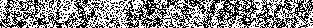 |  |

## Lab 2 – Image segmentation

### Description
The program segmentates a noised image using Min-Sum Diffusion.

### Usage
```commandline
$ python3 image_denoiser.py --help
usage: image_denoiser.py [-h] --img_path IMG_PATH --alpha ALPHA [--n_iter N_ITER] [--c C [C ...]]

Image segmentation on a noised image using diffusion.

options:
  -h, --help           show this help message and exit
  --img_path IMG_PATH  Path to the image to denoise
  --alpha ALPHA        Alpha parameter for binary penalties
  --n_iter N_ITER      Number of iterations
  --c C [C ...]        List of colors to segment
```

### Examples

```bash
python3 image_denoiser.py --img_path "test_images/map_hsv.png" --alpha 3 --n_iter 100 --c "blue lime"
```

|              Noised image              | Segmented image                            |
|:--------------------------------------:|--------------------------------------------|
| 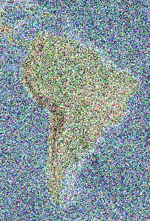 | 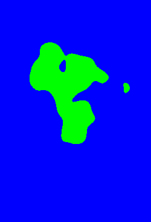 |

### Usage
```bash
python3 image_denoiser.py --img_path "test_images/ipt.png" --alpha 1 --n_iter 100 --c "blue yellow white"
```

|            Noised image            | Segmented image                        |
|:----------------------------------:|----------------------------------------|
| 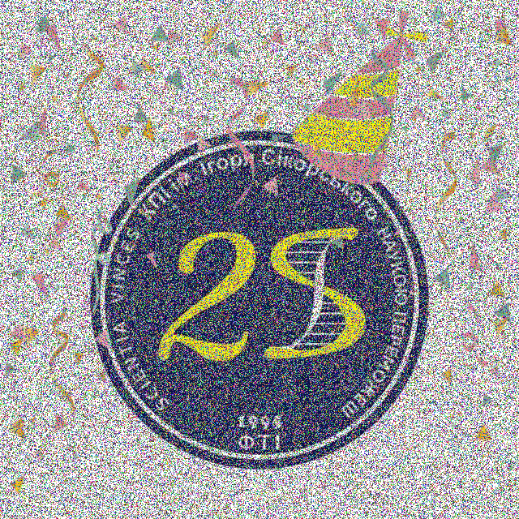 | 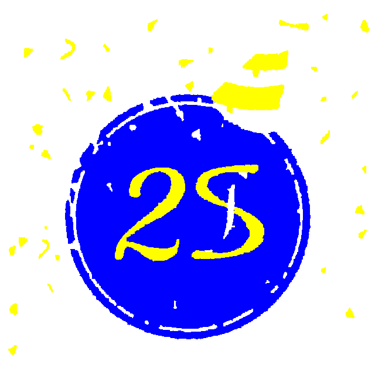 |


## Lab 3 – Image inpainting 

### Description
The program inpaint mask regions using Tree Reweighted Message Passing (TRW-S) algorithm.

### Usage
```commandline
$ python3 image_inpainter.py --help
usage: image_inpainter.py [-h] --img_path IMG_PATH --alpha ALPHA --epsilon EPSILON --n_labels N_LABELS --n_iter N_ITER

Image inpainter using TRW-S algorithm.

options:
  -h, --help           show this help message and exit
  --img_path IMG_PATH  Path to the image.
  --alpha ALPHA        Smoothing coefficient for binary penalties.
  --epsilon EPSILON    Special parameter, which is responsible for lack of color information.
  --n_labels N_LABELS  Number of labels.
  --n_iter N_ITER      Number of iterations.
```

### Examples
```bash
python3 image_inpainter.py --img_path "test_images/mona-lisa-damaged.png" --alpha 0.4 --epsilon 0 --n_labels 64 --n_iter 20
```

|                 Image with marks                 | Inpainted image                     |
|:------------------------------------------------:|-------------------------------------|
| 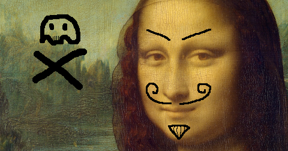 | 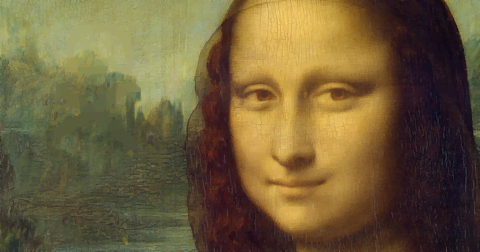 |


## Lab 4 – Interactive foreground extraction

### Description
The program extracts the foreground from an image using the GrabCut algorithm.

Gaussian Mixture Model (GMM) is used to model the foreground and background.
TRW-S as an energy minimization algorithm.

### Usage
```commandline
$ python3 extract_foreground.py --help
usage: extract_foreground.py [-h] --img_path IMG_PATH --mask_path MASK_PATH --gamma GAMMA --n_bg N_BG --n_fg N_FG --bg_color BG_COLOR --fg_color FG_COLOR --em_n_iter
                             EM_N_ITER --trws_n_iter TRWS_N_ITER --n_iter N_ITER

Foreground extraction using EM and TRW-S algorithms.

options:
  -h, --help            show this help message and exit
  --img_path IMG_PATH   Path to the input image.
  --mask_path MASK_PATH
                        Path to the interactive mask (user scribbles marking fg/bg).
  --gamma GAMMA         Smoothness weight for pairwise terms. Controls edge preservation. Range: 10-100.
  --n_bg N_BG           Number of Gaussian components for background GMM.
  --n_fg N_FG           Number of Gaussian components for foreground GMM.
  --bg_color BG_COLOR   Color marking background in the mask (e.g., 'red', 'blue').
  --fg_color FG_COLOR   Color marking foreground in the mask (e.g., 'green', 'yellow').
  --em_n_iter EM_N_ITER
                        Number of EM iterations for GMM fitting per iteration.
  --trws_n_iter TRWS_N_ITER
                        Number of TRW-S message passing iterations per iteration.
  --n_iter N_ITER       Total number of refinement iterations (alternating EM and TRW-S).
```

### Examples

```bash
python3 extract_foreground.py  \
        --img_path "test_images/alpaca.jpg"  \
        --mask_path "test_images/alpaca-segmentation.png"  \
        --gamma 50  \
        --n_bg 3  \
        --n_fg 3  \
        --bg_color blue  \
        --fg_color red  \
        --em_n_iter 10  \
        --trws_n_iter 10  \
        --n_iter 1 
```

|                 Image                  | Manually Marked Mask <br/>(Blue - background, Red - foreground) | Segmentation Mask Result               | Foreground Result                   |
|:--------------------------------------:|-----------------------------------------------------------------|----------------------------------------|-------------------------------------|
| 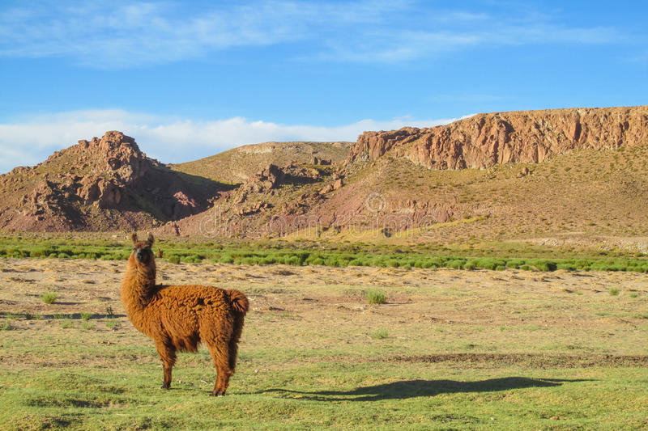  | 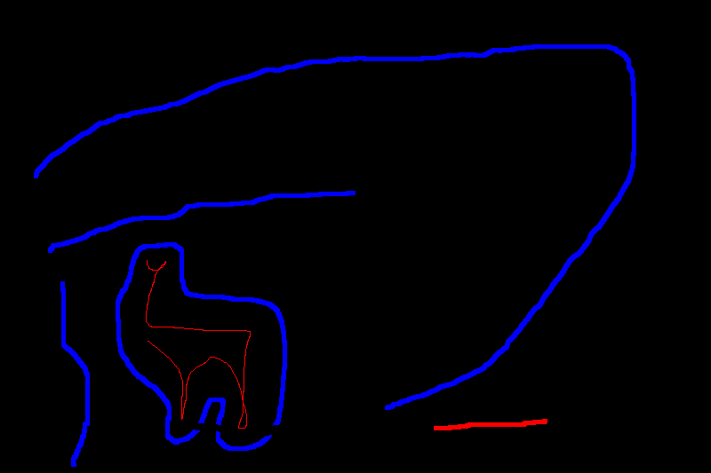              | 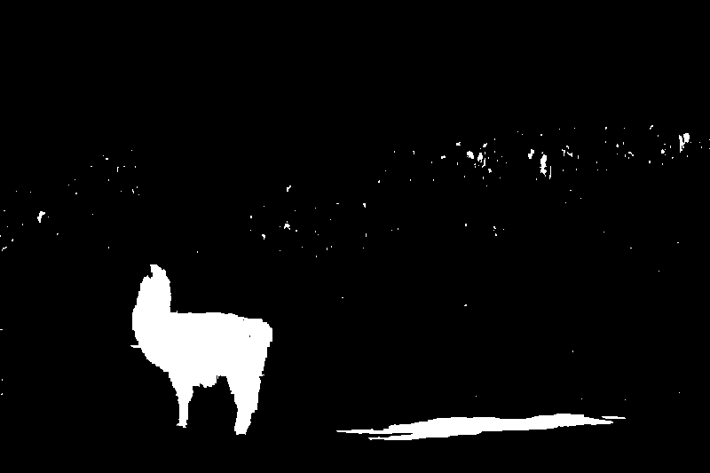 | 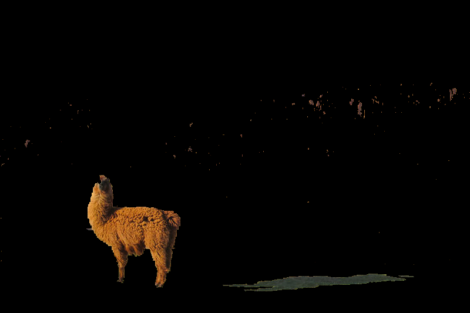 |

```bash
python3 extract_foreground.py  \
        --img_path "test_images/alpaca.jpg"  \
        --mask_path "test_images/alpaca-segmentation.png"  \
        --gamma 50  \
        --n_bg 3  \
        --n_fg 3  \
        --bg_color blue  \
        --fg_color red  \
        --em_n_iter 10  \
        --trws_n_iter 10  \
        --n_iter 1 
```

|                Image                 | Manually Marked Mask <br/>(Green - background, Blue - foreground) | Segmentation Mask Result               | Foreground Result                   |
|:------------------------------------:|-------------------------------------------------------------------|----------------------------------------|-------------------------------------|
| 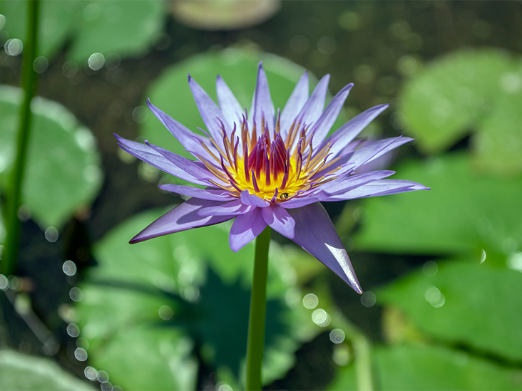 | 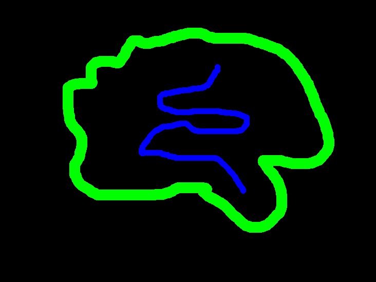                 | 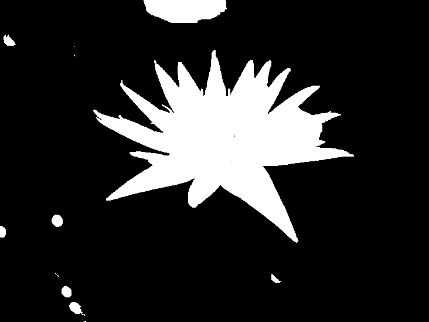 | 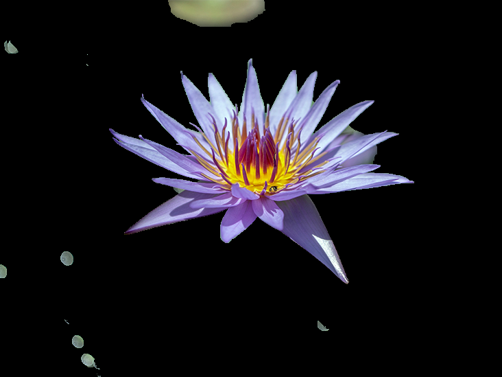 |


## Setup

To run these applications, you need to have **Python3.12**.

1. Clone repo

2. Create virtual environment.
```bash
python3.12 -m venv .venv
```

3. Activate it
```bash
source .venv/bin/activate
```

4. Install requirements:
```bash
pip install -r requirements.txt
```

## Authors
- Maksym Shylo
- Ruslan Khomenko
